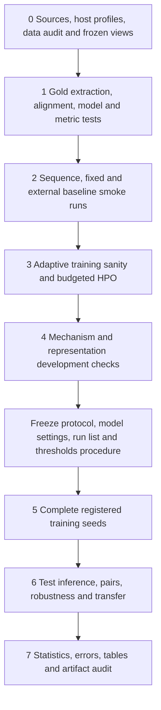

# ASTGuard: definitive research master plan

Protocol version: 1.0, 2026-09-21. Status: research design, not implemented or experimentally validated.

This document supersedes scientific ambiguities in `ASTGuard_Adaptive_Structural_Attention_Proposal_v2.pdf` (all 11 pages reviewed) and `ASTGuard_Codex_End_to_End_Prompt_v2.txt` (including its initial formal-equation requirements). The user's current instruction to plan only supersedes the older instruction to implement immediately. `IMPLEMENTATION_SPEC.md` is the self-contained engineering handoff. No numerical performance results are asserted here.

Confirmed resources: an SSH-accessible machine and a library PC, each described by the user as having about 46 GB VRAM. Treat these as two independent execution resources, not a pooled 92 GB device. GPU models, availability, CPU/RAM, storage and throughput remain unmeasured. No usable CUDA environment was established in this local planning workspace.

## 1. Research question and scope

Does token-conditioned modulation of explicit syntax and approximate data dependencies improve function-level C/C++ vulnerability detection relative to the same pretrained transformer with fixed structural biases, under chronological evaluation, natural class imbalance, controlled training budgets and dependence-aware statistical analysis?

Secondary questions concern low-FPR operation, patch discrimination, structural corruption, data efficiency, project transfer and computational cost. The input is a single function's source text. The output is a vulnerability score and a validation-calibrated binary decision. Repository identity, commit message, CWE, CVE descriptions, patch status, filenames, dates and pair membership are analysis/split metadata, never model inputs.

The model is a benchmark classifier, not a sound static analyzer, a vulnerability localization system, an exploit detector, or a guarantee that a function is safe. Missing caller context, macros, types, aliasing and interprocedural behavior are explicit limits. There is no adversarial-security claim: edge corruption tests imperfect structural extraction, not resistance to an adaptive attacker.

## 2. Final hypotheses and decision rules

Freeze these before test inference. All numerical margins below are design choices, not expected results.

| ID | Falsifiable hypothesis | Registered evidence and decision |
|---|---|---|
| H1, primary | Contextual AST/DFG gates improve ranking beyond fixed structural bias. | Mean test average precision (AP) difference `astguard - ast_dfg_fixed`; meaningful gain is at least 0.01 absolute AP, with multiplicity-adjusted paired interval lower bound above zero. |
| H2, supporting primary | The full method improves over sequence-only CodeBERT. | Same criterion against `sequence_only`. H2 without H1 supports explicit structure, not adaptivity. |
| H3 | Any gain requires useful structural identities and token-specific modulation, beyond extra trainable capacity. | Capacity, linear relation-aware, function-gate, topology and gate interventions in A1/A2/A3; report every control. |
| H4 | The method improves low-false-alarm operation. | Recall gain at calibration-selected FPR target 0.005, accompanied by achieved test FPR and uncertainty; deployment-related claim requires both models' achieved FPR to satisfy the target, not merely calibration compliance. |
| H5 | Modest edge dropout improves robustness. | Difference in corruption-curve area between dropout and ordinary ASTGuard; clean AP loss must be no worse than 0.01 for a favorable robustness tradeoff. |
| H6 | Structural bias helps in particular data/structure regimes. | Registered fraction, dependency-span and extraction-quality curves, with interaction contrasts rather than isolated favorable bins. |

Five paired training seeds for H1/H2: `[42, 123, 456, 789, 1024]`. Other trained conditions use the first three unless explicitly marked development-only. A statistically positive difference smaller than 0.01 is small evidence, not practical success. An interval crossing zero is inconclusive, not equivalence. If the two-sided 90% interval lies entirely inside [-0.01, 0.01], report practical equivalence at that margin with the conditioning assumptions in Section 16. A credible negative difference is a negative result. No metric switching rescues a failed primary hypothesis.

Low-FPR improvement, transfer, interpretability and efficiency are distinct claims and do not follow from AP improvement. The scientific study succeeds if it delivers valid, interpretable evidence, including a null or negative result.

## 3. Novelty stress test and final contribution

The original architectural novelty is modest. Relation-aware attention already exists; graph-derived additive attention biases already exist; contextual gates on attention biases already exist. Specifically, XLM-E Section 3.3 conditions a relative-position bias on the query. This is a direct precedent for the gate family, even though its relations and task differ. [Shaw et al.](https://aclanthology.org/N18-2074/), [Graphormer](https://proceedings.neurips.cc/paper/2021/file/f1c1592588411002af340cbaedd6fc33-Paper.pdf), [XLM-E](https://aclanthology.org/2022.acl-long.427.pdf).

| Atomic component | Classification | What exists / what changes / evidence needed |
|---|---|---|
| Pretrained CodeBERT classifier | Established technique | Common initialization and task head; no novelty claim. |
| AST and data-flow features | Established technique | GraphCodeBERT, SiT, SG-Trans and StructCoder already incorporate code structure. |
| Soft relation-specific logit biases | Established technique/adaptation | Apply graph biases to aligned C/C++ lexical tokens without adding graph tokens. B1-B3 test their value. |
| Query-conditioned sigmoid gate | Adaptation of an established mechanism | Relation/head/layer indexing and fine-tuning task differ; cannot claim invention of contextual gating. |
| Combined AST/DFG gated bias | Combination / limited methodological extension | A concrete, inexpensive specialization whose usefulness requires H1 and mechanism controls. |
| Edge dropout | Established regularization | Secondary robustness extension; must compare clean and corrupted operation. |
| Gate plots | Established descriptive analysis | Gate values alone do not establish importance, causal use, or semantic understanding. |
| Matched training plus topology/gate interventions and low-FPR calibration | Evaluation framework for this study | Jointly tests whether contextual structural selection matters rather than generic extra capacity or graph density. No first-ever framework claim. |
| Results under chronology, patch pairs and decontaminated transfer | Potential new empirical finding | Only becomes a contribution after experiments, whether positive, null or negative. |
| Public artifact and audited C/C++ extraction | System contribution | Reproducibility and transparent limitations, not new static-analysis theory. |

Code-specific overlap includes structure-modified attention in [SiT](https://aclanthology.org/2021.findings-acl.93.pdf), head/layer allocation of code relations in [SG-Trans](https://arxiv.org/abs/2104.09340), and joint AST/data-flow modeling in [StructCoder](https://doi.org/10.1145/3636430). K-ASTRO is particularly relevant because it adds AST-derived attention bias for vulnerability detection; its embedding/augmentation setup differs from the controlled fine-tuning studied here. Its published method must be discussed, not omitted because it weakens novelty. [K-ASTRO v3](https://arxiv.org/html/2208.08067v3).

Recent publisher records also describe token-node cross-attention and semantic/structural gated fusion. Their abstracts and article previews identify relevance but do not establish equation-level equivalence; mark those assessments as publisher-preview-only. [TNA-CAF](https://www.sciencedirect.com/science/article/abs/pii/S0167642326000584), [DualGraphVulD](https://www.sciencedirect.com/science/article/pii/S0950584926002508). Search coverage is targeted, not an exhaustive novelty proof. Record search date, queries, paper version, mechanism, task, available code and full-text/preview-only status in the future literature ledger.

Audit search record, 2026-09-21: query families covered adaptive/gated structural attention with AST/DFG, code structure-guided/structure-induced transformers, gated relative-position bias, the three dataset/baseline repository names, and exact-name searches for K-ASTRO, TNA-CAF and DualGraphVulD with GitHub. Equation-level sources inspected include XLM-E Section 3.3, SiT Section 2.2, StructCoder's encoder and K-ASTRO's attention-bias section. No verified runnable repository for those three recent vulnerability methods was located in this bounded audit; that is not proof that code is unavailable. Preserve their baseline status as `source_not_verified`, give a fixed two-hour public-artifact verification budget in Stage 0, and keep any faithful reproducible public/local comparison as a separately budgeted extension. Never approximate a preview's method and report it as the original model. Until such comparisons are available, restrict claims to the registered controlled mechanism study.

**Defensible contribution statement:** We operationalize query-conditioned relation bias as a small modification of pretrained CodeBERT and test whether contextual selection of syntax and approximate data dependencies adds value beyond fixed structure, generic capacity and simpler relation-aware attention. A preregistered evaluation separates ranking, low-FPR operation, patch discrimination, structural dependence and transfer, with auditable extraction and repeated runs.

The redesign strengthens the scientific mechanism test rather than adding an unmotivated module to manufacture novelty. It adds a linear relation-aware competitor, a function-conditioned control, a capacity control, distribution-preserving interventions, exact structural definitions and operational calibration. If these controls eliminate the advantage, the paper's contribution is the empirical boundary of adaptive structural bias. No theorem of better vulnerability reasoning, first-of-kind claim, or SOTA claim is planned.

## 4. Audit of the original proposal and remedies

| Weakness (proposal location) | Why it matters | Binding remedy |
|---|---|---|
| Novelty positioned mostly against masks and graph fusion (§2) | Misses query-conditioned bias precedents. | Section 3; A1 includes a simpler content-dependent relation bias. |
| Fixed attention said to influence tokens equally | Fixed bias still interacts with content-dependent softmax; degree also changes its effect. | Analyze odds and attention mass; claim coefficient adaptivity only. |
| Leaf tokens versus AST parent-child unspecified (§5.2) | Leaf-leaf parent-child edges can be empty; full-span projection can become a root-induced clique. | Replace with explicit short AST leaf-path relation (Section 7), and separately test anchored parent-child projection. |
| C/C++ DFG assumed obtainable from GraphCodeBERT (§4.4) | Official parser exports other languages, including C#, not C/C++. | Implement a tested, limited C/C++ reaching-definition extractor; never relabel C# as C++. [Official exports](https://raw.githubusercontent.com/microsoft/CodeBERT/master/GraphCodeBERT/codesearch/parser/__init__.py). |
| “DFG” suggests semantic completeness | Pointer aliasing, calls and partial functions invalidate that reading. | Name it approximate intraprocedural dependency graph; define supported constructs and failures. |
| Gate and beta interpretation (§5.3, §10) | Small gate plus large beta can equal a large gate plus small beta; signed beta can suppress edges. | Keep signed beta, record effective coefficients and interventions; do not interpret gate as trust probability. |
| Model can “ignore” structure | Learned sigmoid is rarely exactly zero; absent edges produce no effect regardless of gate. | Explicit zero-bias bypass; analyze eligible queries separately. |
| Classification head and beta initialization absent | Confounds or dead initial gate gradients. | Shared head; matched initial bias; numerical and gradient tests. |
| Structural dropout underspecified | Subword-edge dropout changes tokenization effects and destroys reciprocal edges inconsistently. | Drop lexical edge groups before BPE projection; share masks across heads/layers, no inverted scaling. |
| Sequence truncation versus full-function extraction | Graph construction can use source beyond the model's token window. | Declare full-function structural access; add fully visible-function and visible-prefix controls; no equal-information claim from structure-versus-sequence alone. |
| “PR-AUC or F1” and success via “and/or” (§8-9) | Leaves freedom to change endpoints after observing outcomes. | AP alone primary; exact margins and test families. |
| Official VD-Score versus validation thresholds | Official metric uses evaluated labels to pick the ROC operating point. | Keep `official_vds_oracle` separate from calibrated operational metrics. [Official evaluator](https://raw.githubusercontent.com/DLVulDet/PrimeVul/main/calc_vd_score.py). |
| Reusing all validation for every decision | Architecture/threshold overfitting. | Group-disjoint tuning and calibration partitions. |
| Hashes called near-duplicate audit (§4.1) | Equality hashing detects equality, not near clones. | Exact lexical hashes plus verified token-shingle similarity join; explicit residual risks. |
| PrimeVul version unspecified | Metadata-enhanced v0.1 retains only a subset of vulnerabilities. | Primary original full release, metadata left-join only. [Release note](https://github.com/DLVulDet/PrimeVul). |
| DiverseVul treated as external independence | PrimeVul construction includes DiverseVul. | Remove overlapping code, commits, CVEs and pairs before frozen transfer evaluation. [Dataset construction](https://arxiv.org/html/2403.18624v2). |
| Parse failures could disappear from evaluation | Changes difficulty and prevalence unequally across models. | Retain sample, use empty failed relation and status; report coverage. |
| Extra parameters/optimization capacity | Same backbone does not by itself establish mechanism causality. | Fixed-plus-adapter and linear relation-aware controls; equal search budget. |
| Edge-dropout robustness only on proposed model | Gains may just reflect redundancy/density. | Corrupt fixed and adaptive variants identically, with no-structure negative control. |
| Three seeds plus sample bootstrap | Correlated functions and seeds do not create independent evidence. | Five core seeds, component-cluster bootstrap, seed-level intervals and project sensitivity. |
| Gate subgroup figures treated as explanation | Length/degree/label confounding and observational association. | Matched bins, effective coefficients, edge mass and intervention diagnostics. |
| Pair ordering confused with useful detection | Ranking both versions high or low can still order them correctly. | Pair order plus all four paired threshold outcomes. |
| Missing compute/stopping rules | Large architecture searches can consume the project. | Fixed run ledger, staged budgets and correctness-based gates. |

## 5. Claims, contributions and boundaries

The mathematical contribution is a fully specified specialization, with exact nesting and log-odds properties, not a new optimization theorem. The algorithmic contribution is relation-specific contextual bias during fine-tuning. The system contribution is a tested source-to-relations pipeline and traceable experiment artifact. The empirical contribution is the outcome of the mechanism tests.

Keep three levels separate: (a) measured performance on a specified dataset, (b) experimentally supported use of a structural mechanism, (c) unestablished semantic/security understanding. Only (a) and qualified (b) are goals. Benchmark labels are observations, not ground-truth safety proofs. Pretraining contamination cannot be ruled out without the full training corpus; same-backbone comparisons reduce that confound but do not remove it.

## 6. Data strategy and leakage controls

### 6.1 Releases and metadata

Primary source: original complete PrimeVul release linked by the [official repository](https://github.com/DLVulDet/PrimeVul), with its original chronological train/valid/test and pair files. Published full-release counts are approximately 236k functions; verify actual file counts and SHA-256 rather than assuming a mirror matches. v0.1 metadata may be left-joined by verified function hash; never inner-join the primary sample set or relabel it. Record join misses.

Secondary: original standalone DiverseVul JSONL from its [official repository](https://github.com/wagner-group/diversevul), approximately 349k functions as reported in the proposal. It is not automatically independent of PrimeVul. Optional legacy benchmark: official [CodeXGLUE defect-detection split](https://github.com/microsoft/CodeXGLUE/tree/main/Code-Code/Defect-detection), evaluated separately under its label semantics. Dataset and model download URLs, immutable revisions, byte sizes, licenses/access terms and SHA-256 enter `sources.lock.json`. This planning phase has not downloaded or verified these large artifacts; hashes must be resolved at acquisition, not invented now.

Preserve raw bytes and original IDs, labels and split membership. Stable IDs use `dataset:release:original_id`; retain a raw row index when upstream IDs are missing. An adapter must not manufacture commit timestamps, project IDs, language labels, CWEs or pair links. Null is meaningful. Treat metadata associated with fixing commits carefully: it may describe an event rather than the exact vulnerable revision.

### 6.2 Exact audit and frozen primary view

Perform audit before model development using source/metadata only for overlap decisions. Label counts may be used for integrity checks; test label-outcome analysis is prohibited before protocol lock.

1. Hash raw UTF-8 source. Derive a lexical fingerprint preserving identifiers, operators and literal contents while dropping comments and whitespace. Use a deterministic C/C++ lexer, not whitespace deletion inside string literals. Preserve an additional upstream-compatible normalization hash for comparison only.
2. Verify exact clone groups. Verify near-clone edges by Jaccard similarity >=0.90 of sets of lexical 5-token shingles, with length ratio >=0.80. For <5 tokens use only exact normalized equality. Use an exact prefix-filtered similarity join with sorted shingle IDs, then exact verification; do not claim guaranteed coverage from MinHash alone. Optional identifier-normalized MinHash is a sensitivity audit, not primary exclusion.
3. Form connected components over exact/verified-near-clone links, official pair links, identical normalized repository+commit keys, and identical known CVEs. Missing metadata creates no artificial common group. Preserve giant components and record why they occur; do not cap them to obtain attractive counts.
4. Preserve immutable official split files and the entire official test set. Create `P_clean`: remove training rows whose component intersects original validation or test; remove validation rows whose component intersects test. No test row is removed and no row changes split. Persist every exclusion and its linking evidence. This label-independent purge changes the training setting if overlap exists; label it explicitly. If no overlap exists, `P_clean` equals the official setting.
5. Primary results use `P_clean` for every model. If it differs, a separate official-split reproduction of the three core models is supplementary and visibly marked overlap-exposed; never pool its numbers with the primary setting. This resolves “preserve official split” versus “remove leakage” without silently altering test membership.
6. Partition retained validation components into `V_tune` and `V_cal` by SHA-256 of `validation-v1|component_id`, first 64 bits / 2^64 <0.5 for tune, otherwise calibration. No label stratification or retries. Report counts and prevalence; if either has fewer than 50 positives or calibration fewer than 2,000 negatives, low-FPR estimates are descriptive and tuning still uses only V_tune. If a partition lacks either class, this protocol is infeasible and must be versioned before any test run; do not silently search a better split.

All overlaps, excluded counts and residual unknowns appear in Table T1. This is “no detected supervised overlap under specified checks,” not a proof of complete contamination freedom. Identifier-renamed clones, unknown CVEs and unavailable pretraining data remain limitations.

### 6.3 Transfer and project holdout

`D_transfer`: take standalone DiverseVul, exclude any sample/component linked to **any** PrimeVul split through the same exact, near-clone, repository+commit, CVE or known-pair tests. Freeze before training, preserve original DiverseVul labels, and do not use it for tuning or thresholds. Report both the exclusion waterfall and surviving project/CWE/prevalence profile. If fewer than 200 positives or 20 project clusters survive, transfer is descriptive with broad uncertainty; if no credible independent set survives, mark E5 unavailable rather than weakening exclusion rules. Label disagreements are audited, never resolved by taking whichever label favors a model.

`P_project`: a separate within-PrimeVul project-disjoint study. Normalize repository identity using URL host/path with `.git` removed and explicit alias mapping. SHA-256 `project-v1|project_id` assigns u<0.70 train, 0.70<=u<0.80 tune, 0.80<=u<0.90 calibration, else test. Exclude unknown project identity here only. Preserve each project's whole assignment; purge lower-priority train/tune/cal components that cross into a later partition (test > calibration > tune > train). Use no chronological claim for this split. Require >=200 positive test samples and >=20 test projects for confirmatory transfer interpretation; otherwise report descriptive results without changing the hash assignment.

### 6.4 Availability and preprocessing failures

Malformed raw records with no source or invalid binary label are quarantined before the split lock and produce an invalid-record manifest, never silently omitted. Empty but valid source receives special tokens and no edges. Parser/DFG/alignment failures retain all valid samples. A failed relation becomes empty; the successful relation remains. Alignment corruption that makes both unsafe yields no relations. Model inputs contain source tokens only plus relations. No label-derived feature, learned vocabulary or normalization statistic is fitted outside training.

## 7. Final mathematical formulation and complete method

### 7.1 Input, parser and token alignment (M1)

Let a sample be `(s_n,y_n)`, source string and y in {0,1}. Canonical source for both parsing and tokenization normalizes CRLF to LF only; preserve original source separately. Tokenize with the pinned CodeBERT fast tokenizer, without text reformatting/comment deletion, as `<s>` + first 510 BPE tokens + `</s>`, at most L=512. Original BPE length always counts source tokens before special tokens. Never truncate through a decoded-byte operation; use tokenizer IDs. Pads fill a batch to its maximum length.

Let I_i be a source-token half-open byte interval obtained by converting tokenizer character offsets through an explicit character-to-UTF-8-byte map. Use overlap, not equality, to align an interval to lexical leaves. Zero-width/special/pad offsets are unaligned. A BPE span overlapping multiple leaves maps to all those leaves; preserve multiplicity and collapse duplicate relation edges later. A partially visible lexical leaf is ineligible for structural edges (all its overlapping BPE pieces must be retained). Whitespace-only tokens are unaligned. Round-trip tests cover Unicode, leading spaces, CRLF, multibyte characters and string literals.

Parse canonical full source with both pinned Tree-sitter C and C++ grammars if language metadata is absent/unreliable; choose fewer error/missing nodes, then more covered source bytes, then C on a tie. Source metadata must not override a demonstrably failed parse. Exclude comment nodes from structural leaves. Keep anonymous operator/punctuation terminals. No synthetic wrapper in the core pipeline. If the chosen tree has any error/missing node, AST and DFG are empty with `parse_failed`; a later parser improvement is a new preprocessing version.

The core syntax graph is explicitly a lexical projection of Tree-sitter's concrete syntax tree, called AST for continuity. Internal grammar nodes and anonymous terminals matter; no claim that it is a compiler-normalized AST.

### 7.2 Structural relations (M2)

Let lambda_i be the set of eligible lexical leaves overlapping token i. Let d_T(a,b) be undirected edge distance in the chosen parse tree. Define the primary syntax relation:

`M_AST[i,j] = 1[i != j and exists a in lambda_i, b in lambda_j: a != b and 0 < d_T(a,b) <= 4]`.

Thus different leaves close in the tree are linked symmetrically. Pieces of the same identifier are not linked solely for being its subwords. There is no root-to-all clique from expanding a whole internal-node span. Radius 4 is frozen, not tuned on test. An anchored parent-child alternative is specified in A4 to check sensitivity to this deliberate change from the draft.

The approximate DFG uses lexical variable occurrences as nodes. Bind identifiers to lexical-scope declarations; parameters are entry definitions. Construct a local control-flow graph for supported structured statements. For a CFG node v:

`IN[v] = union_{u in pred(v)} OUT[u]`,

`OUT[v] = GEN[v] union (IN[v] minus KILL[v])`.  (M3)

Definitions of the same scalar binding are killed by a later definite assignment. Solve this finite monotone reaching-definition problem to a fixed point, including loop back edges. For each read occurrence u, add directed `(u,d)` to all matching definitions d reaching that read; a query at the use can attend to its definition. For assignment target occurrence d_new, also add `(d_new,u)` for RHS read occurrences u. Compound assignment/increment reads before defining. No graph labels become model features.

Supported core: parameter/local declarations, scalar assignments, nested blocks, expression statements, if/else, while/do/for, break/continue, return, lexical shadowing and scalar reads inside call arguments. Each expression is lowered to read/definition events in its defined sequencing order. Unsequenced or unsupported modifying expressions disable DFG for the function. Calls yield argument reads but no callee/alias/side-effect edges; pointer/array/member expressions yield reads of scalar base/index operands but no memory definition-use claims. Unknown globals have reads but no invented local definition. Function/type/member names are not scalar bindings. `goto`, switch/fallthrough, exceptions, lambdas/captures, coroutines, unresolved declaration binding, and preprocessor conditional control disable the function's DFG with a specific status; AST may still be valid. No silent Java/C# parser substitution.

Project each lexical DFG edge to the Cartesian product of the two eligible leaf-to-BPE sets, deduplicate, remove i=j and any special/pad endpoint:

`M_DFG[i,j] = 1[there exists a lexical dependency from lambda_i to lambda_j]`.  (M4)

This extractor is deliberately incomplete and is not claimed sound for full C/C++. Record unsupported constructs and the fractions of supported/nonempty relations by language, length and label. A DFG with zero edges can be successful; distinguish it from failure. Store lexical edges, projection groups and sparse token edges, never dataset-wide dense matrices.

Full-function parsing/flow precedes truncation, and only surviving endpoints are retained. This can encode facts derived from omitted suffixes, especially loops. It is valid inference-time information because the function is available, but a modality/context difference versus truncated sequence-only CodeBERT. E10 therefore includes fully visible functions and a visible-prefix structural control. The primary H1 comparison has identical full-function structure in both methods.

### 7.3 Backbone, bias, gates and head (M5-M8)

CodeBERT-base has hidden size d=768, H=12 heads, d_h=64 and 12 layers; verify pinned configuration rather than hard-coding assumptions into the loader. [Checkpoint configuration](https://huggingface.co/microsoft/codebert-base/blob/main/config.json). Bias is active at zero-based layers S={2,5,8,11}. All variants retain the pretrained embedding, position IDs, Q/K/V projections, attention dropout, residuals, post-attention blocks and layer norms.

For h_i^(l-1) in R^768, Q_i,K_i,V_i in R^64, r in {AST,DFG}, W^(l,h,r) in R^(1x768), b and beta scalar:

`q_ij = Q_i K_j^T / sqrt(64)`.

`g_i,r = sigmoid(W_r h_i + b_r)`; `c_i,r = beta_r g_i,r`.  (M5)

`S_ij = q_ij + sum_r c_i,r M_r[i,j] + P_j`, where P_j=0 for real/special tokens and -infinity for padding keys.  (M6)

`A_ij = softmax_j(S_ij)`; `O_i = sum_j dropout(A_ij) V_j`.  (M7)

Dropout is off in evaluation. Score/softmax accumulation uses float32 where needed under autocast; output returns to model dtype. Padding is the only hard attention mask in the controlled family. Special tokens have zero structural rows/columns but retain normal semantic attention. Every sequence contains at least `<s>` and `</s>`, so no row has all keys masked. Padded query outputs are ignored by pooling and diagnostics.

Sequence-only has c=0. Fixed models use c_i,r=beta_r with no gate, per active layer/head/relation. Adaptive uses M5. beta is a **signed unconstrained real coefficient**, not a probability or necessarily positive magnitude. Preserve the draft formula; no sigmoid-normalization across relations and no gate sparsity/entropy objective. Structure can favor or disfavor linked keys. Ordinary connections stay available, though a large finite bias can effectively concentrate attention.

Initialize new gate W=0, b=0, beta=0.10, giving c=0.05. Initialize fixed beta=0.05, so fixed and adaptive models start with the same score perturbation for the same relation set. All other new weights use the same saved initialization for paired model seeds. Nonzero beta gives gate gradients immediately. A zero-beta initialization is a development diagnostic, not a hidden condition selection.

The common classification head takes final `<s>` state u, computes:

`z = w_out^T Dropout(tanh(W_cls Dropout(u) + b_cls)) + b_out`, `p = sigmoid(z)`.  (M8)

W_cls is 768x768, w_out is length 768, dropout=0.1. Use one logit and the same head across controlled models. p is a model score under weighted training, not automatically a calibrated vulnerability probability. Inference executes the same extraction, alignment and model with all training dropout disabled, then applies a saved threshold.

### 7.4 Objective, regularization and structural dropout (M9-M10)

For N training examples with N_c examples of class c, set `w_c = N/(2 N_c)` on the actual training view/subset. A missing class is an invalid training condition. Optimize:

`L = (1/N) sum_n [ w_1 y_n softplus(-z_n) + w_0 (1-y_n) softplus(z_n) ]`.  (M9)

Use stable logits arithmetic, not log(sigmoid(z)) directly. This equals the draft weighted BCE. Each minibatch averages per-sample weighted losses over examples, not over total weights; gradient accumulation must reproduce that global-batch average, including partial final batches. AdamW weight decay is decoupled, not an additional claimed loss term. It acts on backbone/head matrices and gate W, excludes biases, layer norms and beta; no focal loss/balanced sampler in the main study. Unweighted BCE is a registered sensitivity test.

For the dropout variant, lexical edge groups e have `Z_e ~ Bernoulli(1-q)` with q=0.10 at each training presentation; retain e iff Z_e=1 before BPE projection. (M10) AST reciprocal edges share one draw; a directed DFG edge is one group. Deduplicate surviving projected edges by OR. No 1/(1-q) scaling. The mask is shared across all heads and layers. q=0 during clean inference. The complete data loader, augmentation RNG and model RNG states are checkpointed.

### 7.5 What the equations do and how to verify them

| Equation | Computation/purpose | Implementation | Usefulness or correctness check |
|---|---|---|---|
| M1 input/alignment | Keep sequence and structural coordinates consistent. | `CanonicalTokenizer`, `ByteSpanAligner`. | Unicode/truncation fixtures; E10 visible-context checks. |
| M2 syntax relation | Provide local tree proximity without span-induced cliques. | `SyntaxRelationBuilder(radius=4)`. | AST-only, no-AST and anchored-projection A4. |
| M3-M4 DFG | Supply supported intraprocedural value dependencies. | `StructuredCFG`, `ReachingDefinitions`, projection. | Gold fixtures, DFG-only/no-DFG and direction controls. |
| M5 gate/coefficient | Vary a relation's score effect with the current query representation. | One 768 -> (12x2) linear map per active layer, sigmoid, beta broadcast. | Function gate, linear relation bias, gate interventions; gradient tests. |
| M6-M7 attention | Preserve semantic attention and add relation priors. | Explicit attention module preserving upstream operations. | Zero-bias equivalence, fixed/adaptive equality at initialization, empty-graph tests. |
| M8 classifier | Produce a single function-level logit. | Shared RoBERTa-style head. | Same initialized weights, save/load equivalence. No scientific head claim. |
| M9 objective | Balance positive/negative training contribution. | Weighted BCE-with-logits. | Weight provenance test and unweighted A4. |
| M10 edge dropout | Expose training to missing relations. | Lexical-edge-group sampling. | Dropout-off invariant; E7 clean-versus-corrupted curves. |
| M11-M13 metrics below | Measure ranking, deployment thresholds and pairs. | One shared evaluator. | Exact hand-computed metric fixtures and upstream VD-S parity. |

### 7.6 Mathematical audit, edge cases and deductions

Every original equation on PDF pp.4-6 is accounted for: scaled dot product (M6), softmax and V_j sum (M7), binary relations (M2/M4), fixed score (M6 with constant coefficients), sigmoid gate (M5), adaptive score (M6), weighted BCE (M9), and zero-structure equivalence. Duplicated formulas in the implementation prompt receive the same definitions. The signs and dimensions are consistent. Added equations address missing extraction, head, dropout, threshold and analysis definitions.

For nonpadding j,k in one head, with hidden states and coefficients fixed:

`log(A_ij/A_ik) = q_ij-q_ik + sum_r c_i,r (M_r[i,j]-M_r[i,k])`.

This is the exact local meaning of the bias, not a theorem about better classification. If a row's relation entries are all identical, its contribution cancels under softmax. An all-zero relation has no effect. A query gate cannot distinguish two keys with the same relation vector, and its nonnegative multiplier cannot reverse a given head/relation beta's sign for different queries. At the first structurally modified layer, the gate cannot observe fresh graph corruption because its inputs precede that layer; later gates can respond only indirectly through preceding structural layers. Therefore the gate is content-conditioned, not an estimator of current edge correctness.

Setting all betas to zero exactly nests the sequence architecture **at identical weights**, not a separately fine-tuned sequence checkpoint. `W=0`, b constant reduces adaptive bias to a fixed coefficient after rescaling beta, demonstrating nested expressivity. g and beta are not uniquely interpretable from their product; even equal effective coefficients may yield different downstream importance because values and attention competitors differ. No identifiability or causal-explanation claim is made.

Degeneracies: beta->0, gate saturation, empty/noisy graphs, uniform relation rows, and gate/degree correlation. Log gradient norms, beta, c=beta*g and eligible-row variability. Nonfinite losses are failures. Large |beta| or saturation are reported, not “fixed” by post hoc regularizers after test access. Parser/extractor operations are discrete and receive no gradients; gradients flow to backbone, gate and beta through attention.

## 8. Training and model-selection protocol

Use Python 3.11 and a pinned tested PyTorch/Transformers/Tree-sitter environment; establish exact versions on the GPU hosts before freezing a lockfile. Do not assume this planning workspace's Python 3.14 is suitable. No paid inference/API dependency.

Common training recipe: full fine-tuning, AdamW (betas 0.9/0.999, epsilon 1e-8), weight decay 0.01 under Section 7 exclusions, global gradient norm clip 1.0, linear LR warmup for 10% of optimizer steps then linear decay, effective batch 32, dropout 0.1, sequence length 512, maximum 5 epochs. Evaluate V_tune each epoch; no early stopping before epoch 3, then patience 2 with absolute AP improvement >0.0001. Best V_tune AP selects checkpoint; ties select earlier epoch. Save all validation scores. Do not use V_cal for checkpoint/HPO decisions.

Four common HPO cells per controlled model: pretrained/head LR in {1e-5,2e-5} x new-module LR multiplier in {1,5}. For sequence-only apply multiplier to the new classification head, ensuring four meaningful cells; for structural models apply it to head and structural parameters. Screen all four on the same 25% training subset for 3 epochs with seed 42; promote the top two by V_tune AP to complete training for up to 5 epochs, still seed 42. Choose on V_tune AP; final seed runs restart independently at selected settings. A final seed-42 run may reuse a byte-identical promoted full-training run, with provenance; ledger counts conservatively assume no reuse. Additional seed data is never used to choose a preferred seed.

Primary structural configuration S={2,5,8,11}, AST radius 4 and dropout q=0.10 are fixed. Placement and representation ablations never replace it based on test performance. A shared-recipe sensitivity run fixes all three core models to LR=2e-5, multiplier=1 to separate mechanism from HPO choice; reuse final runs if identical. The direct comparison otherwise means equally tuned methods, not identical final LR.

Microbatch starts at 4 with accumulation 8 on each 46 GB GPU, BF16 if supported, otherwise FP16 with scaler or FP32. Profile before raising batch size. Activation checkpointing is allowed and recorded consistently across controlled variants; effective batch and scheduler units remain unchanged. Independent run parallelism across hosts is preferred over distributed training. Pair seeds and minibatch orders; separate RNG streams prevent extra gate initialization/dropout from changing backbone initialization and data order. Exact equality of stochastic trajectories is not promised across different hardware.

## 9. Baseline suite and fairness

| Model ID | Exact role and training | Priority |
|---|---|---|
| `prior` | Constant p=training prevalence; majority at 0.5; threshold metrics follow shared calibration. No fitted test statistic. | Required sanity. |
| `tfidf_lr` | Case-sensitive C/C++ lexical unigram/bigram TF-IDF, max 100k train-fit features, min_df=2, L2 logistic regression, C in {0.01,0.1,1,10}, train-only balanced weights, max_iter=2000. Select C on V_tune AP. Same first-510-token source window for matched input; full-source version separate. | Required classical baseline; may be competitive. |
| `sequence_only` | M8/M9 CodeBERT, no graph. | Required; five seeds. |
| `ast_fixed` | M6 constant beta with AST only. | Required; three seeds. |
| `dfg_fixed` | Constant beta with DFG only. | Required; three seeds. |
| `ast_dfg_fixed` | Both relations, per-layer/head beta, no contextual gate. | Required; five seeds. |
| `astguard` | M1-M9, both relations, four active layers. | Required; five seeds. |
| `astguard_dropout` | Same plus M10, q=0.10. | Required; three seeds. |
| `graphcodebert_c_adapted` | Official GraphCodeBERT checkpoint and graph-node embedding/mask logic, C/C++ extractor adaptation described below. | Required integration attempt; three seeds when valid. |
| `linevul_function` | Official LineVul function classifier retrained from CodeBERT; no line-level labels/patch strings/features. | Required integration; three seeds. |
| `fixed_adapter` | Fixed AST+DFG plus small trainable token adapter, near-matched added parameter count. | Required mechanism control A1. |
| `linear_relation` | Content-dependent linear relation score with same inputs and approximately same parameters as gate. | Required conceptual control A1. |
| `function_gate` | Same gate weights evaluated on mean real-source-token hidden state, broadcast to all queries. | Required token-versus-function control A1. |
| `regvd` | Pin official token-graph model and CodeBERT embeddings; tune window {3,5} and LR {1e-4,1e-3}, keeping published graph/readout configuration. | Preferred graph control, before optional backbone expansion. |
| `devign_gnn` | Faithful original architecture with documented rich-graph extraction and embeddings. | Optional if extraction reproducible; no guessed architecture. |
| `unixcoder` | Public UniXcoder sequence classifier under common splits; same four-cell fine-tuning budget. | Optional stronger alternate encoder, no causal claim. |

Use the official [CodeBERT/GraphCodeBERT repository](https://github.com/microsoft/CodeBERT), [LineVul replication package](https://github.com/awsm-research/LineVul), and [ReGVD implementation](https://github.com/daiquocnguyen/GNN-ReGVD). Source revisions, licenses and local changes must be recorded before import. Library changes for compatibility must preserve model mathematics and pass adapter prediction parity checks. An unavailable baseline is an explicit status row, never a zero or fabricated result.

GraphCodeBERT adaptation: preserve its code-token/DFG-node construction, graph-guided mask, averaged token initialization for DFG nodes and position-ID conventions. Allocate 384 code positions including two specials and up to 128 graph nodes, total <=512. Sort graph occurrences by source byte position and retain edges among retained nodes. Use this study's supported C/C++ dependencies; label the result an adaptation, not an official C/C++ reproduction. Train an additional matched-input trio (`sequence_only`, fixed, adaptive) capped at 384 positions for the context-budget comparison. The 512-source-token trio remains primary. An ordinary sequence classifier loaded with GraphCodeBERT weights is a different baseline, `graphcodebert_sequence`, and cannot substitute silently for graph-guided evaluation.

LineVul: inspect the pinned forward path; reproduce the published function head, loss and tokenization in one adapter recipe and export probabilities to the common evaluator. Allow its official settings as one of a four-trial budget: (published recipe, common LR=1e-5 weighted, common LR=2e-5 weighted, common LR=2e-5 unweighted), V_tune AP selects. Retain original training-configuration details with results. If its function classifier is effectively identical to sequence-only under the harmonized recipe, report that equivalence instead of presenting two names as independent architectures. Do not load a BigVul-trained checkpoint into the main comparison because overlap/history would differ.

ReGVD/Devign may consume different graphs or longer source. Report those differences and extraction coverage. For every model, all valid test IDs must get predictions or an explicit failed-run status; common-success subsets are supplementary only. No accuracy comparison restricted to whichever inputs one model parsed successfully. External models may use their natural environments and heads, but share train/tune/cal/test IDs, natural class distribution, seed policy and evaluator.

## 10. Metrics and operating points

Primary is **average precision**, not trapezoidal PR area. With distinct score thresholds k and associated precision P_k and recall R_k:

`AP = sum_k (R_k - R_(k-1)) P_k`.  (M11)

Use the library's noninterpolated AP semantics, including tie grouping. Report ROC-AUC, confusion counts, accuracy, precision, recall, F1, MCC, FPR and FNR as secondary. For zero predicted positives, precision/F1=0 with `no_positive_predictions=true`; ROC-AUC/AP on single-class slices are null with a reason. Undefined MCC is null (also optionally export library convention 0 separately). Never turn missing/undefined values into measured zeros.

Choose thresholds separately for each fitted seed using V_cal only and predictions `p>=t`:

* `t_f1`: maximize F1; tie -> lower FPR, then larger threshold.
* `t_lowfpr`: among distinct score thresholds plus +infinity satisfying empirical FPR<=0.005, maximize recall; tie -> lower FPR, then larger threshold.
* `t_recall80`: largest threshold giving recall>=0.80; this measures false alarms at a validation-targeted recall, not guaranteed matched test recall.

Store counts, rule, split hash and exact threshold including an explicit representation of +infinity. Apply unchanged to primary test, corruption conditions, transfer and subgroups. The operational metric is:

`recall_cal005 = TP_test(t_lowfpr) / N_positive_test`, alongside `fpr_cal005 = FP_test(t_lowfpr) / N_negative_test`.  (M12)

Always show achieved test recall for t_recall80 and achieved test FPR for t_lowfpr. A model that meets the target only on calibration has not demonstrated compliance on test. Sample uncertainty at rare operating points is substantial; report counts and intervals. FPR binomial intervals are descriptive because samples cluster; cluster bootstrap is the primary uncertainty method.

`official_vds_oracle`: reproduce the pinned upstream ROC-threshold procedure (FNR at FPR<=0.005 selected on the evaluated set). This is lower-is-better, a test-distribution discrimination summary, **not** a deployable threshold or evidence that calibration succeeded. Store its threshold in a separate diagnostic namespace and never pass it to deployment predictions, patch decisions or transfer. Same for any test-ROC “matched recall” curve. Parity-test with official code; document its handling of ties and missing classes.

For each official vulnerable/patched pair (v,b), report:

`pair_order = mean(1[p_v>p_b] + 0.5*1[p_v=p_b])`, `pair_margin = z_v-z_b`.  (M13)

Also report four disjoint fractions at both t_f1 and t_lowfpr: PC=(1,0), PV=(1,1), PB=(0,0), PR=(0,1), where order is vulnerable then patched decision. They sum to one. PC and pair_order answer different questions. Official pair IDs determine membership; never infer pairs from adjacent rows. Track identical retained input tokens, visible patch location and whether the pair changes structural edges. Scores on such pairs cannot establish semantic repair understanding.

Weighted BCE distorts natural posterior calibration. Brier score and 15 equal-width-bin ECE are descriptive secondary diagnostics on raw scores; no calibrated-probability claim. A calibration method would require a separately registered extension, not post hoc probability adjustment.

## 11. Complete experiment matrix

The following common contract applies to **every row**, and is part of its specification: source and preprocessing M1-M4; training Section 8; model definitions Section 9; `P_clean` training, V_tune selection, V_cal thresholds and fixed official test unless a row states otherwise; seed list from Section 2; raw per-example predictions, resolved config, split/cache/checkpoint hashes and run status saved. All pretrained models start from their declared public pretraining checkpoint, not another experiment's test-selected model. No row gets a private test-tuned hyperparameter budget. Effect sizes/intervals follow Section 16; development-only rows make no test claim.

### 11.1 Main experiments

| ID | Hypothesis / exact comparison | Data and models | Seeds / hyperparameters | Metrics / artifacts / allowed conclusion |
|---|---|---|---|---|
| E1 | H1/H2: adaptivity and structure help. | P_clean; all eight main neural models in Section 9 plus prior/TF-IDF. | Five for sequence/fixed-combined/ASTGuard, three others; common HPO contract. | AP primary, all operational metrics; `main_results`, per-seed predictions, T2; only specified split/backbone claims. |
| E2 | AST/DFG contributions are nonidentical. | Reuse E1 no-structure, AST, DFG, combined fixed; add AST-only and DFG-only adaptive. | Three seeds, core selected hyperparameters held fixed for the two new models. | AP and PC contrasts; T3; increment from each relation, not proof of complementary semantic reasoning. |
| E6 | Distinguish vulnerable from patched code. | Official test pairs, reuse every available E1 checkpoint. | No new fitting or threshold selection. | M13 and four outcomes, logit margins, CIs; T4/F3; patch discrimination only. |
| E8 | Quantify cost of structural bias. | Sequence/fixed/adaptive/dropout plus external models when valid; fixed 1,000-example inference sample. | Seed 42, same device/backend, Section 21 timing protocol. | Parameters, memory, preprocessing and model/end-to-end timing; T6; measured cost only. |

### 11.2 Mechanism ablations

| ID | Intervention and hypothesis | Models/data/training | Metrics / artifact / conclusion |
|---|---|---|---|
| A1 | Extra parameters, linear relation bias or function-wide conditioning explain gains. | Train `fixed_adapter`, `linear_relation`, `function_gate`, three seeds, same four-cell HPO contract. Compare to E1. | AP, low-FPR recall, parameter count and time; T3. Advantage over fixed alone is insufficient if these controls explain it. |
| A2 | Learned query allocation matters at inference. | On each five-seed ASTGuard checkpoint: original gates; clamp each layer/head/relation to training-set mean; replace by within-function eligible-query mean; degree-bin-preserving query permutation; zero one relation at a time. No retraining. | Paired AP/logit change and edge mass; F4. Functional sensitivity, subject to intervention distribution shift. No claim of mediation identification. |
| A3 | Structural identity, not just density/locality, matters. | Fixed and adaptive retrained on degree-preserving rewired relations, three seeds, same selected hyperparameters; compare with clean E1. Also inference-only rewiring in E7. | AP and valid-rewire rate; T3. Training on rewired relations distinguishes semantic graph benefit from OOD corruption alone. |
| E3 | Layer placement matters. | Adaptive layers early {0,1,2,3}, middle {4,5,6,7}, late {8,9,10,11}, distributed {2,5,8,11}; all {0..11} separate larger variant. | Screen all on 25% train, seed42, 3 epochs, V_tune AP. Freeze best nondistributed four-layer configuration and train it with three seeds; report all screening values. Three-seed test contrasts exploratory because selection used validation. All-layer is development-only unless budget expansion frozen before test. |
| A4 | Projection, degree, direction and loss choices explain results. | On 25% train and V_tune, fixed/adaptive: anchored AST instead of radius; AST/DFG M divided by sqrt(max(1,row degree)); DFG symmetrized; unweighted BCE. Change one item at a time, seed42, 3 epochs. | AP/coverage/degree/gradient logs; `representation_sensitivity`. Development findings only; no hidden adoption into E1. If expanding to test, register all four conditions and run three seeds each before test access. |
| A5 | HPO settings rather than architecture explain gains. | Three core models at LR2e-5/multiplier1, first three seeds, reuse identical final runs. | AP differences versus individually tuned results; T3 appendix. Shared recipe sensitivity, not proof all optimization confounding is absent. |
| A6 | Head/layer/relation specificity and learned beta are necessary. | Adaptive model on 25% train, seed42, 3 epochs: separately share gate W/b across heads, across active layers, or across relations; fourth variant freezes beta=0.10. Other parameters and recipe unchanged. | V_tune AP, effective coefficient variability and parameter counts; `gate_granularity`, development-only. No claim that each specificity is necessary without a separately registered three-seed test extension. |

Control formulas: `linear_relation` substitutes `c_i,r = a_r + U_r h_i/sqrt(768)`, initial a=0.05, U=0, no beta/gate product; it adapts relation-aware query terms rather than claiming an exact Shaw implementation. `function_gate` replaces h_i in M5 with the masked mean of real source-token h; empty source uses zeros. `fixed_adapter` inserts `h -> h + U_up GELU(U_down h + b_down)` as the input to Q/K/V only at each active layer, leaving the residual stream unchanged; rank=12, no up bias, down random/up zero. Per layer its 18,444 parameters closely match 18,456 gate parameters; both separately include the same beta count. It does not establish identical function classes or exact FLOP matching; report measured differences.

A2 permutation: within each function/layer/head/relation, permute gates among eligible BPE queries within projected token-degree bins {1,2-4,5-16,17+}; singleton bins remain unchanged and are counted. Use a deterministic Fisher-Yates permutation seeded from the corruption seed plus sample/layer/head/relation IDs. This exactly preserves the gate multiset per bin, but may separate subword pieces; label it a token-level intervention. Use corruption seeds [1001,1002,1003,1004,1005]. Training-set means are fit on a fixed 10k training-ID hash sample in eval mode after training, never test labels. Distinguish unweighted query mean and edge-weighted summaries.

At each intervention layer, recompute gates from the intervention forward's current hidden states before applying the replacement; do not silently reuse clean-run hidden states. Thus the intervention alters downstream representations as well as the local bias.

A3 rewiring: at lexical level, for directed edges (a,b),(c,d), propose (a,d),(c,b), rejecting self loops, duplicates, ineligible endpoints and changed source-distance bins {1-4,5-16,17-64,65+ lexical positions} for either edge. AST uses analogous undirected double-edge swaps preserving symmetry. Propose until 10 times edge count successful swaps or 100 times edge count attempts; record successful rate, never claim full randomization if constrained. Freeze one rewired graph per sample/relation using hash seed1001 for training and evaluation; no label inputs. Degree is preserved lexically; report projected degree differences from BPE multiplicities.

A4 anchored AST: assign each internal node its leftmost noncomment terminal descendant; terminals anchor themselves. For each tree parent-child edge with different anchors, add both anchor directions, deduplicate, then BPE-project. This is a clearly named parent-child projection sensitivity, not equivalent to the radius relation.

A6 sharing ties only W and b: head-shared retains separate layer/relation gates; layer-shared retains head/relation gates; relation-shared retains layer/head gates. beta stays independently learned per active layer/head/relation in these three conditions. The frozen-beta condition retains all original gates and disables beta optimization at 0.10. All start with the same effective coefficient 0.05. These parameter reductions are reported, not treated as capacity-matched comparisons.

### 11.3 Robustness, generalization and failure analysis

| ID | Hypothesis / controlled variation | Dataset/models/seeds/settings | Metrics / artifacts / conclusion |
|---|---|---|---|
| E4 | H6: label efficiency changes with structure. | Nested training component fractions {0.10,0.25,0.50,1.00}, identical V_tune/V_cal/test; sequence/fixed/adaptive, first three seeds. | AP versus realized examples/positives and training compute; F2. 100% reuses E1. Fixed recipe selected at full size, recompute train weights; no per-fraction retuning. Group hash, no repeated subset lottery. |
| E5 | Transfer beyond shared source data. | Frozen D_transfer, E1 sequence/fixed/adaptive/GraphCodeBERT, first three seeds; no target fitting. | AP, prevalence, operational metrics, overlap waterfall; T5. Dataset transfer under declared label mismatch, not universal robustness. |
| E7 | H5: edge quality affects model behavior. | Fixed/adaptive/dropout; source unchanged. Separate deletion and degree-preserving swap corruption rates {0,.05,.10,.20,.40,1}; corrupt AST only, DFG only, both. Three model seeds x five corruption seeds; sequence-only invariance check. | AP, fixed-threshold recall/FPR, clean-relative degradation, trapezoidal area over corruption rate; F5. Paired curve differences averaged over corruption seeds, not pseudo-replicated tests. |
| E9 | Gate coefficients vary and are used. | E1 adaptive/dropout held-out predictions; mean/median/std, g<.05/g>.95 on eligible queries, beta, beta*g, edge-attention mass, A2. | `gate_statistics`, F4; descriptive patterns plus functional perturbation evidence, no “explanation of vulnerability” claim. |
| E10 | Truncation, parser quality and dependency extent explain wins/losses. | E1 predictions binned by original BPE length <=128,129-256,257-510,>510; parse/DFG status; lexical degree; DFG span quartiles learned from training only. Three core models; all core seeds. | AP only where both classes exist, counts, PC, label-conditioned errors; F6. Observational subgroup associations. |
| E10b | Extra unseen source context explains structural advantage. | Reuse E1 on fully visible functions; train fixed/adaptive visible-prefix variants with three seeds. Replace suffix beyond last retained lexical byte by spaces, parse that prefix with Tree-sitter error recovery, accept only error-free subtrees fully inside prefix; DFG only complete supported statements, no suffix/back-edge facts. | AP versus full-extraction versions, coverage, PC; T3 appendix. An information-budget sensitivity, with changed extraction coverage reported. |
| E11 | Held-out projects generalize. | P_project split; sequence/fixed/adaptive, three seeds, E1 selected recipe without project-test tuning; use P_project tune/cal for checkpoint/thresholds. | AP, project-macro AP on eligible projects, operational metrics; T5. Project transfer, not chronological extrapolation. |
| E12 | Failures have identifiable recurring causes. | Deterministic stratified sample from four correctness cells (sequence/adaptive), at t_f1, 20 examples/cell by hash; plus 20 pairs by hash. Review 100 cases if available, all first-seed results, model identity blinded during coding. | Taxonomy/counts, raw annotations, five representative examples selected by fixed hash within categories; no success-only illustration. |

E7 deletion removes a nested hash-ranked fraction of lexical edge groups; rate1 removes all. Swap corruption attempts to touch the requested fraction of original edges using A3 rules and logs achieved corruption; rate1 need not fully randomize a constrained graph. All lexical choices are shared between fixed/adaptive models. No threshold is retuned under corruption. A missing relation remains missing. Structural deletion at rate1 equals each model's own zero-bias forward pass, not the separately trained sequence model.

For implementation, define achieved corruption as the fraction of original lexical edges absent in the final graph (undirected AST groups counted once), not merely edges ever touched by a swap. For each requested swap rate, restart from the clean graph with the same seeded proposal stream; stop when achieved fraction reaches the target or after 100*edge_count attempts. Report overshoot and failed targets. The curve's x-coordinate is the edge-count-weighted achieved fraction over the evaluation cohort, identical across compared methods. Deduplicate repeated x-coordinates and integrate over the common achieved range; do not extrapolate to 1.0 if constraints prevent it. Zero-edge cohorts produce no robustness-area claim.

E4 exact fraction rule: SHA-256 `fraction-v1|train_component_id` uniform u; include u<f. Fractions are nested but approximate in sample count; report realized prevalence and components. If a fraction lacks a class, mark it infeasible without redrawing. One draw of a training subset limits population-wide label-efficiency claims. To test update-budget confounding, a predeclared development-only repeat at 10% uses the full-data optimizer-step count for all three core models, reporting repeated-example exposure separately.

E12 taxonomy: truncation/invisible patch; failed/missing structure; unsupported alias/call/context; lexical shortcut; wrong relation; label ambiguity; both models confidently wrong; threshold tradeoff; unresolved. Two human reviewers are preferred; if only one is available, say so and do not invent agreement. Flag label disputes for analysis without relabeling the locked benchmark. Measure comments/project/name sensitivity through errors; no unsound source mutation is presumed label-preserving.

## 12. Outcomes that remain informative

| Observed result | Interpretation | Follow-up already specified |
|---|---|---|
| Fixed and adaptive beat sequence, adaptive ~= fixed | Explicit structure may help; contextual gate not needed at this budget. | A1/A2 effective coefficient variability; practical-equivalence interval. |
| Adaptive beats fixed but not fixed_adapter/linear_relation | Generic capacity or content-dependent bias is sufficient. | Report the simpler successful mechanism and restrict novelty. |
| Gains disappear with rewired training graphs | Evidence structural identities matter beyond degree/locality. | Check swap acceptance and BPE degree confounds. |
| Gains persist on rewired graphs | Topology/regularization/density may explain them. | A4 degree normalization; do not call it semantic dependence. |
| AP improves, operational FPR fails | Ranking improved; low-FPR transfer/calibration did not. | Threshold drift, negative-tail plots and raw FP counts. |
| Dropout helps corrupted graphs but harms clean | Robustness-performance tradeoff. | Full curve and clean margin, not a universal robustness claim. |
| All structural models lose | Structures/extraction/optimization may be unhelpful here. | Gold extraction audit, visibility and failure strata, A4. |
| Gates change but interventions have negligible effect | Variation is not evidence of functional importance. | beta*g and relation-row degeneracy checks. |
| No valid independent DiverseVul set | Cross-dataset claim unsupported. | E11 project holdout remains separate evidence. |

## 13. Reviewer attack and revisions

These are simulated reviews performed within this plan, not independent external reviews.

| Reviewer / round | Strong rejection argument | Concrete revision and residual risk |
|---|---|---|
| A, mathematics, round 1 | A sigmoid times a relation coefficient is familiar and not identifiable; gates do not prove selective reasoning. | Cite XLM-E; provide nesting/log-odds analysis; A1 linear competitor, A2 interventions, signed effective coefficients. Residual: no semantic identifiability. |
| B, experiments, round 1 | Shared dataset ancestry, test-selected ROC thresholds and clone leakage can explain all improvements. | P_clean purge, D_transfer audit, V_tune/V_cal split, separate official oracle metric. Residual: unavailable pretraining corpus. |
| C, novelty, round 1 | AST+DFG attention exists, and adding gates alone is incremental. | Recast as controlled mechanism study; include prior-aware controls and failure curves. Residual: architectural novelty remains limited. |
| A, round 2 | The graph is undefined at token level and noisy C++ flow makes the formula meaningless. | M1-M4 exact leaf relation, scope/reaching definitions, supported-subset policy, independently authored gold fixtures and coverage gates. Residual: incomplete static semantics. |
| B, round 2 | Density, extra parameters, longer structural context, seed selection and tuning budgets remain confounded. | fixed_adapter, rewired training, 384-token graph baseline control, E10b, fixed seed/HPO manifest and A5. Residual: external models differ in pretraining and architecture. |
| C, round 2 | One older backbone and one main corpus cannot establish SOTA or practical usefulness. | Limit claim to controlled CodeBERT study; require modern alternate encoder only for broader claims, retain low-FPR and full-cost evidence. Residual: external validity needs later studies. |

Major criticisms now have tests, exact mechanisms or explicit claim limits. They are not guaranteed to be satisfied by future results. A rejection risk that survives the proposed evidence must remain in the limitations section.

## 14. Repository architecture

Implement a small Python package, YAML configurations validated by typed dataclasses, Parquet/JSONL artifacts, pytest and a dependency-aware launcher. Use explicit functions, not a general-purpose model/plugin framework.

```text
README.md  LICENSE  pyproject.toml  requirements.lock  sources.lock.json
RESEARCH_MASTER_PLAN.md  IMPLEMENTATION_SPEC.md
configs/{base,models,experiments,hardware}/
protocol/{protocol_v1.json,experiment_manifest.jsonl,test_unlock.json}
astguard/
  config.py  train.py  evaluate.py
  data/{download,adapters,schema,audit,splits,subsets,preprocess,collate}.py
  parsing/{trees,lexical,scopes,cfg,reaching_defs,relations}.py
  alignment/{byte_spans,tokenizer,projection}.py
  models/{codebert,attention,bias,gates,heads,controls}.py
  baselines/{simple,graphcodebert,linevul,regvd,devign,unixcoder}.py
  training/{engine,optim,checkpoint,seeds}.py
  evaluation/{predict,metrics,thresholds,pairs,bootstrap}.py
  analysis/{gates,interventions,errors,efficiency,aggregate,tables,plots}.py
  utils/{hashing,provenance,atomic_io}.py
scripts/{run_smoke_test,run_experiment_suite,run_baselines,freeze_protocol,
         benchmark_hardware,verify_results,reproduce_tables}.py
tests/{unit,integration,golden}/
docs/{method,data,baselines,experiments,reproducibility,limitations}.md
third_party/{LICENSES,adaptation_notes}/
data/{raw,interim,processed}/
artifacts/{audits,preprocessing_failures,environment}/
runs/<run_id>/
results/{tables,figures,raw_aggregates}/
```

Core interfaces: `DatasetAdapter.read`, `LeakageAuditor.build_components`, `SplitBuilder.freeze`, `CanonicalTokenizer.encode`, `ByteSpanAligner.align`, `SyntaxRelationBuilder.build`, `StructuredCFG.build`, `ReachingDefinitions.solve`, `RelationProjector.project`, `StructuralCollator`, `StructuralSelfAttention.forward`, `RelationGate.forward`, `ASTGuardClassifier.forward`, `Trainer.fit`, `ThresholdSelector.fit`, `Evaluator.evaluate`, `ClusterBootstrap.compare`, `ResultAggregator.build_tables`.

Every equation and control has a module. A standard run exports common predictions even when an external adapter trains in a separate environment. `IMPLEMENTATION_SPEC.md` fixes schemas, tensors, configuration fields, CLI contracts, acceptance tests and construction order. Raw data/checkpoints/caches are ignored by version control; lockfiles, protocol, tiny synthetic fixtures, aggregate artifacts and scripts are tracked. Never invent a repository license covering upstream dataset/code rights; preserve notices and choose an appropriate license for original code separately.

## 15. Experiment dependency graph and GO/NO-GO gates



| Stage | GO conditions | NO-GO response |
|---|---|---|
| 0 | Legal/public source path recorded, actual counts/hashes known, no undocumented ID loss, frozen split/component manifests, resources profiled. | Resolve wrong release/schema or missing source. No replacement dataset chosen by performance. |
| 1 | All gold and numerical tests pass; 50-example train-only audit (25 chosen C/25 C++ where available) has zero systematic byte/span errors. | Fix extraction/version caches and repeat affected checks. |
| 1 extraction | AST nonempty on >=90% of nonempty functions <=510 BPE; DFG supported on >=60% of that train-only slice; on 30 manually annotated supported functions projected dependency precision >=0.90 and recall >=0.80 against the **defined** limited semantics. | Improve extractor before expensive DFG study. If infeasible, freeze a scoped AST-only research revision before test; do not claim original AST+DFG question answered. These are engineering thresholds, not assertions about current coverage. |
| 2 | 32-example balanced training fixture can be overfit (>=95% training accuracy); metrics and prior AP checks correct; external adapter status and 384 budget explicit. | Debug labels, optimizer, precision, tokenization. Low natural validation AP alone is not a pipeline failure. |
| 3 | Nonzero finite gate/beta gradients, matched initialization, no memory leak, model can learn; per-run budget measured. | Debug implementation or numerics; record all failed runs. |
| 4 | Core mechanism functions under synthetic interventions, HPO budget complete, ablation configs fixed. | Correctness failure blocks main runs. A valid null validation result does not justify discarding study; retain small full core suite. |
| 5 | Required seeds finished or failed with explicit reasons; complete predictions possible; protocol/test unlock hash created. | Resume hardware-interrupted runs. Never replace bad seed results with favorable seeds. |
| 6 | Same test IDs and score schemas, no threshold tuning on target data, corruption seeds shared. | Fix evaluator bugs globally, invalidate affected artifacts and record incident; do not selectively rerun a model. |
| 7 | All tables regenerate from preserved predictions; multiplicity/failure/missing runs visible; claims meet Section 23. | Withdraw unsupported claims or finish missing evidence. |

Freeze test execution separately from training. Operational failures are not scientific stopping criteria. If compute is constrained after a null validation result, still complete the precommitted core comparison and report omitted extensions; do not suppress negative core test results. Future exploratory analyses after test access must be labeled exploratory, never substituted as preregistered findings.

## 16. Statistical analysis and power

Experimental unit for method variability is a training seed; unit for dataset dependence is a component from Section 6. Samples sharing pair/commit/CVE/clone component stay together. Use identical bootstrap component draws for models being compared. Do not resample function rows independently or count corruption repeats as independent test sets.

For each seed compute AP separately, then average; never average probabilities across seeds for the main metric. Report every seed, mean, sample SD. Primary comparisons are ASTGuard versus fixed-combined and versus sequence-only. Use Bonferroni-adjusted 97.5% two-sided intervals for each of these two differences, yielding familywise 95% coverage under the interval approximation. Practical success also requires mean difference >=0.01.

Run 10,000 paired hierarchical bootstrap replicates with fixed analysis seed20260921: resample five paired seed indices with replacement; independently resample test components with replacement, shared across those seeds and both models; calculate each seed's metric on the repeated component rows and then average differences. Percentile intervals are approximate. Retain replicate estimates. If a replicate lacks either class, omit it and report frequency; >1% invalid replicates triggers a warning and no confirmatory interval for that slice. Also report a component-only interval conditional on the fitted seeds and a paired seed-level Student-t interval (df=4), clearly labeled; disagreement limits claims rather than choosing the narrowest interval. Require positive adjusted seed-level and hierarchical lower bounds for a strong H1/H2 statement; otherwise label the gain provisional.

Project-cluster bootstrap is a sensitivity analysis for shared repository dependence beyond known components. If a known component bridges projects, collapse linked projects into superclusters before that sensitivity bootstrap. Report cluster counts, largest cluster weights and leave-one-largest-project-out differences. Fewer than 20 clusters supports descriptive inference only. Rare-subgroup AP requires >=30 positives and >=30 negatives; otherwise report counts/recall/errors without inferential ranking claims. CWE groups overlap and are descriptive unless a new family is registered.

Threshold metrics use the saved per-seed V_cal threshold for the principal conditional interval. An additional calibration-aware bootstrap independently resamples calibration components, refits the threshold per fitted seed, and resamples test components; report this wider source of uncertainty. It does not rerun HPO or training. Official oracle VD-S recomputes its own operating point in each test bootstrap but remains separately labeled. Pair analyses resample pair-containing components, retaining both members.

A1/AP tests form a secondary family of three comparisons; use Holm-corrected paired seed tests and bootstrap effect intervals, explicitly low-powered at n=3. Every comparison uses the intersection of planned paired seed IDs (the first three when comparing a three-seed control with a five-seed core model); do not compare a three-seed mean to a five-seed mean in a paired test. Other exploratory comparisons use effect sizes/95% intervals without “significant discovery” claims. No uncorrected searching across layer/head/CWE/corruption cells. Corruption curve area averages per corruption seed first; compare paired method-level areas across training seeds/components.

Before final training, simulate detectable AP differences from development predictions and observed cluster structure, using only V_tune and seed variability available there. Report an approximate minimum detectable effect at 80% power, not a promised study power. If five seeds are inadequate, either increase all three core models to the same additional seed set before test unlock or retain five and acknowledge inconclusiveness. Do not add seeds conditional on favorable test significance.

## 17. Gate and failure analysis details

Compute statistics on eligible query rows with at least one relation edge; separately report unaligned and zero-degree token counts. Save g, beta and c quantiles by layer/head/relation; eligible-query saturation proportions; signed c distribution; gradient norms during training. Edge mass is `sum_j A_ij M_r[i,j]` before attention dropout; overlaps mean relation masses need not sum to one. Compare to zero-bias attention at the same layer's fixed Q/K for a local diagnostic; distinguish that from a full-model zero-relation forward pass.

Use a fixed sample of up to 2,000 test IDs by hash for detailed token/head analysis, no favorable-example selection. Gate statistics over all data can be streamed; do not save full attention tensors for every test function. For label/CWE comparisons, stratify jointly by length and degree bins, require adequate counts and report missing metadata. At most 10 CWEs with highest **training** positive support receive named plots; test-popular categories do not determine the list.

False positives: show confidence tails, project/length distributions and examples at both thresholds. False negatives: show parser failure, truncation and context dependence. Pairs: explicitly count identical token inputs and identical projected relation inputs; a deterministic model must give equal scores for identical full inputs in eval mode. Report ambiguous labels separately without altering evaluation.

## 18. Reproducibility and result integrity

Each run directory is immutable by ID and contains resolved config, code commit or source archive hash, dirty diff hash, environment lock hash, hardware metadata, all RNG seeds, dataset/split/preprocessing hashes, exact command, HPO parent, logs, validation history, checkpoint-selection record, thresholds, predictions, metrics, timing and status. Configuration IDs hash canonical serialized configs; timestamp+hash+seed creates unique run IDs. Never overwrite a previous run; a resumed run appends a documented event and verifies config/state equality.

Cache keys include canonicalization, lexer, grammar/parser, DFG and projection versions, tokenizer/checkpoint revision, sequence length and relation definition. Labels are stored separately from forward-pass feature records. Checkpoints include model/optimizer/scheduler/scaler/RNG/step/sampler state; weights-only best checkpoints are separate. Save failures and NaNs; the ledger includes planned, running, complete, failed, blocked and omitted statuses with reasons.

Preserve per-sample logits/probabilities and calibration predictions. Programmatic aggregation checks the same sample IDs, split hash, threshold source, metric version and model/seed set before joining. Every table cell links to source run IDs and prediction hashes. Never enter result values by hand. Raw artifacts and protocol changes are append-only. A test-discovered evaluator bug invalidates every affected result, with a public incident record and global rerun; it is not a license to change the hypothesis.

## 19. Test and validation requirements

Scientific correctness tests are mandatory even though no code is implemented in this phase. Unit fixtures cover C/C++ parsing, CFG branches/loops and lexical scopes, intentional unsupported constructs, AST distances, DFG direction, UTF-8 offsets, BPE split identifiers, truncation, empty source, padding, deterministic lexical-edge dropout and sparse batching. Gold expected edges must be independently written from the limited semantics, not generated by the same extractor.

Model release blockers: zero structural contribution equals upstream CodeBERT at identical weights in eval/FP32 (CPU atol1e-6/rtol1e-5; GPU FP32 atol1e-5/rtol1e-4), same logits and each hidden layer; fixed/adaptive identical at matched initialization; no relation edge to specials/pads; normal attention to nonedges remains possible; nonzero finite gate/beta gradients; relation permutation/padding invariance; checkpoint round trip; inference dropout disabled. Mixed precision gets separately measured tolerances and may not weaken the FP32 equivalence gate.

Evaluation blockers: known tied AP example, confusion counts, threshold tie/+infinity handling, four pair outcomes summing to one, oracle-versus-calibration namespace separation, cluster bootstrap pairing, no test-label access in threshold fitting, no metadata features, train-only TF-IDF and class weights, split component disjointness, no existing run overwrite and no stale cache acceptance.

The smoke test runs on synthetic fixtures and a deterministic train-only public subset partitioned into smoke train/valid/test; it must not expose official test labels during development. It covers acquisition/import, parsing, alignment, training a few batches for sequence/fixed/adaptive, threshold fitting, inference, common predictions, one gate artifact and a generated table. Passing smoke demonstrates plumbing, not research performance.

## 20. Expected paper artifacts

| Artifact | Content | Provenance |
|---|---|---|
| T1 | Dataset versions, split counts/prevalence, purges, pair counts, parser/DFG/alignment coverage. | Frozen manifests and preprocessing audit. |
| T2 | Main AP and operational recall/FPR, MCC/F1, mean/SD/intervals and external baseline statuses. | E1 predictions and thresholds. |
| T3 | Mechanism, relation and shared-recipe ablations with parameter/time differences. | E2/A1/A3/A5/E10b; development-only A4 separated. |
| T4 | Pair ordering and PC/PV/PB/PR at both saved thresholds. | E6. |
| T5 | Decontaminated transfer and project holdout with composition changes. | E5/E11. |
| T6 | Training/inference/model size/memory/extraction overhead. | E8 measured hardware logs. |
| F1 | Architecture with relation projection and exact additive score location. | M1-M8. |
| F2 | AP versus training fraction and compute. | E4. |
| F3 | Precision-recall curves and operational points; paired margin distribution. | E1/E6. |
| F4 | Gates, effective coefficients and intervention changes. | E9/A2. |
| F5 | Deletion/swap corruption curves with uncertainty. | E7. |
| F6 | Length, DFG-span and extraction-status outcomes with counts. | E10/E12. |

Render tables as CSV/Markdown/LaTeX from the same result data. Save figures as PDF/SVG plus PNG and their input tables. All model names carry setting/release/input-budget qualifiers where they differ. Missing runs are NA with reasons.

## 21. Compute, storage and cost strategy

Use each available ~46 GB GPU as an independent worker after recording its model, VRAM, precision support, driver, CPU/RAM and storage. Do not infer throughput from VRAM. Assign identical seed comparisons across hosts in a balanced manner; do not confound all adaptive runs with one GPU/precision. Benchmark E8 on one fixed host; cross-host numbers are separate.

Parameter estimates: CodeBERT about 125M. With 4 active layers, 12 heads, 2 relations, d=768, gate weights+biases add `4*12*2*(768+1)=73,824`; beta adds 96. The shared head adds about 0.59M relative to the bare encoder. Fixed models add at most 96. This is small parameter overhead, not necessarily small runtime overhead.

For B=4,L=512,H=12, one FP32 attention-score tensor contains 12,582,912 elements (~48 MiB); both Boolean relation masks together are ~2 MiB. Backpropagation retains additional tensors across 12 layers. Do not create [B,R,H,L,L] copies or keep every layer's attention for analysis. Model/gradient/Adam state for ~125M parameters is roughly 2 GB before activations and temporary kernels. Planning envelope is 12-30 GB for microbatch4 BF16 training, possibly 20-40+ GB without checkpointing or with inefficient dense attention. These are estimates requiring measurement; 46 GB should be treated as a limit with at least 4 GB headroom.

Throughput assumption for budgeting only: 20-100 training functions/second at up to 512 tokens, depending on hardware and backend. With approximately 184k original training functions, 5 epochs imply ~2.6-12.8 GPU-hours plus validation/checkpoint costs, budget **3-15 GPU-hours per full run**. Record actual N_train after purge. Formula: hours = epochs*N_train/(measured examples/sec*3600) + measured evaluation/I/O overhead. Prefix/graph-node baselines may differ substantially. No rental price or total-dollar claim is known; cost = measured GPU-hours times the user's actual rate plus storage. Owned/library resources still consume scheduled machine time.

### 21.1 Registered run ledger and priorities

| Tier | Planned training count | Full-run-equivalent estimate | Purpose |
|---|---:|---:|---|
| Protected main final runs | Eight main neural models x3 plus two extra seeds each for three core models =30. | 30 | E1, reused by pairs/robustness/transfer/analysis. |
| Main HPO | 8x(4 proxy +2 full)=48 trials. | 8*(4*.25*3/5+2)=20.8 | Equal search budget; excludes final-run reuse savings. |
| Mechanism controls | A1 three models x3 final=9; their HPO adds18 trials; A3 two models x3=6; E2 two adaptive single-relations x3=6. | 9+7.8+6+6=28.8 | Required for a strong mechanism paper. |
| Shared-recipe A5 | At most9 final runs; reuse identical configs. | <=9 | Training-protocol sensitivity. |
| Data efficiency | 3 models x3 seeds x3 new fractions=27. | 3*3*(.10+.25+.50)=7.65 | E4 curves. |
| Layer study | 5 proxy runs +3 full nondistributed finalists. | .75+3=3.75 | E3. |
| Representation diagnostics | 2 models x4 variants=8 proxy runs; four gate-granularity proxy runs; three 10%-data fixed-step checks. | 1.2+.6+3=4.8 | A4, A6 and E4 step-budget diagnostic. |
| Matched GraphCodeBERT source budget | 3 controlled models x3=9. | 9 | 384-position controlled comparison. |
| Visible-prefix study | 2 models x3=6. | 6 | E10b. |
| Project holdout | 3 models x3=9. | <=9 | E11, adjusted to retained train size. |

The complete registered neural plan has at most 200 training jobs (counting short HPO/proxy jobs separately) and approximately 128.8 full-run equivalents, before optional baselines, official-split sensitivity if needed, or all-layer expansion. This is roughly 385-1,935 GPU-hours at the illustrative 3-15h/run range, plus 10-20% inference/analysis overhead. Two continuously available GPUs roughly halve elapsed training time; availability may dominate. The protected main tier plus main HPO is 78 jobs /50.8 equivalents, about 150-760 GPU-hours. Actual pilot timings replace these estimates before scheduling.

Optional ReGVD/Devign/UniXcoder each adds its explicit four-trial HPO budget and three final runs; actual full-run equivalence is measured because their compute differs. If P_clean differs from official, official-split core sensitivity adds9 full runs. Stop optional expansion before sacrificing core five-seed comparisons, baseline integrity or required extraction tests. A reduced report without A1/A3 must omit the strong mechanism attribution claim.

### 21.2 Storage and efficiency protocol

Expect raw source/metadata roughly 1-10 GB depending on downloaded file-context bundles; do not download unused full-file bundles by default. Sparse processed tokens/offsets/edges for ~600k functions may require 10-50 GB, measured after a 1k-sample pilot. Dense per-sample 2x512x512 Boolean masks alone would exceed 300 GB across both datasets and are prohibited. Float32 weights ~0.5 GB per encoder; optimizer/resume checkpoint ~1.5-2.5 GB. Keep one best weights file and one last resumable state per active run; retain best weights and predictions after verified completion, archive/remove resume states only under an explicit retention setting. Plan 300-700 GB shared/archive capacity for the full campaign, with 100 GB working space per host. Do not delete the only copy of an artifact supporting a reported result.

E8: 1,000 test IDs chosen by hash, stratified into fixed length bins, label-independent. Time extraction on canonical source (cold and warm cache separately), host-to-device transfer, model-only inference and uncached end-to-end inference. Batch sizes1 and16; warm up50 batches, time200 batches with CUDA synchronization, repeat three times. Report median/mean/p95 latency, throughput, peak allocated/reserved VRAM and CPU RSS, excluding warmup; state padding and precision. Run controlled models with identical eager attention for causal overhead and additionally report optimized sequence-only backend as a practical competitor. Do not present a slow baseline kernel as the only efficiency reference.

## 22. Four-month execution plan

Month1: pin resources/releases, freeze views, implement/test lexical scopes, relations and alignment; establish baseline pipeline and measured budget. Month2: exact structural attention, controls, external adapters, HPO and preregistration lock. Month3: complete fixed seed ledger, run paired/robustness/transfer inference and prioritized additional training. Month4: statistical analysis, blinded error review, figures/tables, public artifact audit and writing. This schedule depends on measured GPU availability; scope reductions follow the tier order, not favorable results.

## 23. Claim-to-evidence matrix

Every future paper claim must match a row. “Required result” is a necessary condition, not an assertion it will occur.

| Claim | Experiment | Metric | Baseline | Required result | Allowed conclusion |
|---|---|---|---|---|---|
| Adaptive bias improves ranking beyond fixed bias. | E1 | AP difference | ast_dfg_fixed | >=.01 mean gain; adjusted hierarchical and seed intervals >0. | Improvement in this controlled CodeBERT setting. |
| Structure improves ranking over the backbone. | E1 | AP | sequence_only | Same criterion. | Benefit of full structural method; adaptivity requires preceding row. |
| Token-specific gating adds value beyond generic capacity. | A1/A2 | AP contrasts and intervention changes | fixed_adapter, function_gate, linear_relation | Gain survives controls; gate interventions alter useful predictions; secondary-family correction reported. | Evidence favoring this allocation mechanism; not universal necessity or causal mediation. |
| Graph identity matters beyond degree/locality. | A3/E7 | Clean/rewired AP difference | degree-preserving rewired fixed/adaptive | Real-graph advantage with adequate realized rewiring; projected-degree diagnostics. | Utility of supplied relation identities under this control. |
| Lower false-alarm operating cost. | E1 | recall_cal005 and achieved FPR | fixed and sequence | Positive recall difference with uncertainty and both achieved test FPR<=.005; show FP counts/intervals. | Better observed operating tradeoff; no future deployment guarantee. |
| Better benchmark VD-Score. | E1 | official_vds_oracle | same-setting models | Lower score with paired interval. | Better retrospective low-FPR discrimination only. |
| AST and DFG each contribute. | E2 | AP drop on removal | adaptive AST-only, DFG-only and fixed counterparts | Each removal hurts with uncertainty supporting difference. | Both relations useful in this representation; not proof of reasoning synergy. |
| Better patch discrimination. | E6 | Pair order and PC | fixed, sequence, external available | Improvements in claimed metric, ties/visible edits accounted for. | Distinguishes benchmark pairs; PC claim needs PC gain. |
| Dropout improves structural robustness. | E7 | Corruption-curve area, clean AP | ordinary ASTGuard and fixed | Favorable paired area; clean loss<=.01, achieved corruption disclosed. | Robustness to specified edge process, not adversarial code changes. |
| More label efficient. | E4 | AP vs fraction and compute | sequence and fixed | Predeclared curve interaction supports benefit at limited data, not only one favorable point. | Benefit on these nested subsets/training budgets. |
| Transfers across datasets. | E5 | AP and unchanged-threshold metrics | fixed/sequence/GraphCodeBERT | Independent surviving data, adequate clusters, positive effects with uncertainty. | Transfer to decontaminated DiverseVul under its labels. |
| Generalizes to unseen projects. | E11 | AP/project-macro AP | sequence/fixed | Positive held-out-project result with cluster uncertainty. | Project transfer under the fixed project protocol. |
| Gates reflect relation usage. | E9/A2 | beta*g, attention mass, intervention changes | clamped/permuted/zeroed gates | Functional changes beyond descriptive correlation. | Model uses these terms; no human-like explanation claim. |
| Modest resource overhead. | E8 | Latency/memory/preprocess/parameters | fixed/sequence eager and optimized sequence | Report actual ratios; use “modest” only if total batch1 end-to-end median <=1.25x sequence and peak VRAM<=1.25x on fixed host. | Limited overhead in measured conditions, not architecture-wide efficiency. |
| Reproducible and auditable evaluation. | Stage7 | Exact regeneration/hash checks | recorded protocol | Fresh aggregation reproduces table cells and complete provenance. | Reproducible artifacts in tested environment; not guaranteed bitwise cross-hardware training. |

## 24. Implementation checklist

- [ ] Resolve and hash official sources, exact model revisions and environments on both GPU hosts.
- [ ] Preserve official files; freeze audit components, P_clean, tune/cal, D_transfer and P_project manifests.
- [ ] Implement source-only feature contract, supported C/C++ extraction and deterministic sparse cache.
- [ ] Pass independently specified alignment/graph fixtures and coverage/quality gates.
- [ ] Implement shared classifier, fixed/adaptive scores, dropout and three mechanism controls.
- [ ] Pass FP32 zero-bias equivalence and gradient/inference invariants.
- [ ] Integrate GraphCodeBERT C/C++ adaptation and LineVul; log all external availability decisions.
- [ ] Implement exact metrics, saved calibration thresholds, paired evaluation and clustered statistics.
- [ ] Complete synthetic/train-only smoke pipeline and profile both hosts.
- [ ] Generate a finite experiment ledger with budgets and dependencies; complete development HPO without test results.
- [ ] Freeze selected recipes and protocol; complete required seeds; run unchanged test inference.
- [ ] Run applicable controls, transfer/robustness/pairs/error analyses with declared limitations.
- [ ] Regenerate every figure/table and verify claim-to-evidence restrictions.

## 25. Final planning consistency check

Equations M1-M13 map to named modules and tests. H1/H2 use AP, H4 uses validation-calibrated operating points, and all other claims have explicit evidence requirements. Ablations change one identified component, or are labeled multi-factor external comparisons. Baseline input/pretraining/HPO differences are declared; graph-input-budget controls are specified. Supervised split contamination is audited and purged by frozen source/metadata rules; residual pretraining/unknown-clone risks remain disclosed. Every planned result has seeds, config, source/split hashes, predictions and a regeneration path.

No empirical replication, data coverage, source checksums, GPU runtime or model superiority is claimed verified in this planning phase. Those are execution acceptance gates, not missing scientific design choices. Implementation may resolve dependency versions and measured resource settings under the rules above; changes to equations, datasets, hypotheses, split rules or test-selection procedures require an explicit protocol revision before test access. The engineering handoff below contains the executable contract without requiring the next model to invent the research.
